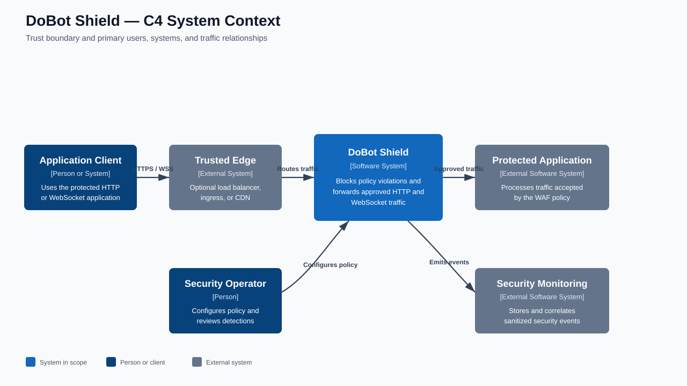
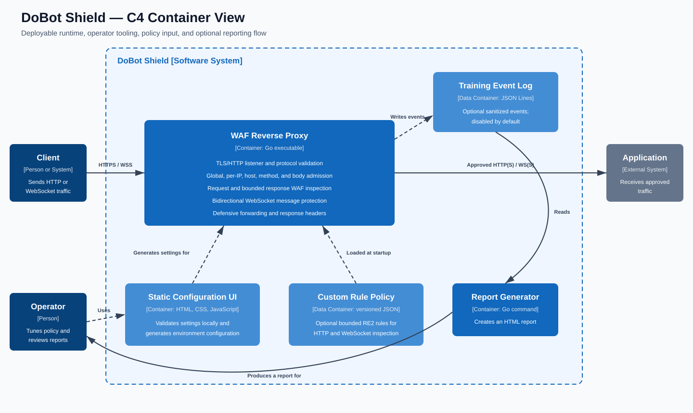

DoBot Shield blocks malicious HTTP and WebSocket traffic before it reaches an application and forwards traffic that passes its configured policy.

[](https://go.dev/) [](https://github.com/yurIdeLimaDev/DoBotShieldV2/actions/workflows/security.yml) [](#deployment-with-docker-compose) [](#websocket-protection)

# DoBot Shield

DoBot Shield is a defensive reverse-proxy Web Application Firewall (WAF) written in Go. It enforces bounded protocol, traffic, request, response, and WebSocket controls before forwarding approved traffic to one configured HTTP or HTTPS backend.

The project is intentionally small and self-contained. Its static configuration page is available at [`admin-config/index.html`](admin-config/index.html), and its optional Training Mode produces a self-contained HTML security-event report.

> [!IMPORTANT]
> DoBot Shield is a compensating control, not a substitute for secure application design, parameterized queries, contextual output encoding, authorization, dependency maintenance, or a mature ruleset such as OWASP Core Rule Set. Tune it in monitor mode against representative traffic before enforcing it in production.

## Security posture

The default configuration favors predictable enforcement and reduced data exposure:

- WAF request inspection and bounded response inspection are enabled in `block` mode.
- Training Mode is disabled and redacts common credentials when enabled.
- Response XSS matching is opt-in because HTML documentation and security-training pages commonly contain literal script examples.
- SQL-error and stack-trace response rules apply to error responses by default; file-disclosure rules remain active for every inspected response.
- Incoming request bodies, decoded bodies, URLs, headers, structured JSON/XML/form values, and multipart content are bounded.
- Ambiguous HTTP framing, malformed metadata, unsupported content-encoding chains, invalid structured bodies, and TRACE/TRACK are rejected before proxying.
- The upstream `Host` is used by default, untrusted forwarding and routing-override headers are stripped, and trusted forwarding chains are rebuilt.
- Access-log fields are quoted, sanitized, and truncated to reduce log-injection and log-amplification risk.
- TLS 1.2 is the minimum for the frontend and HTTPS upstream verification remains enabled by default.
- Global and per-IP admission controls limit resource exhaustion.
- WebSocket traffic is terminated and re-originated so complete messages can be size-bounded, rate-limited, and inspected in both directions; compression is disabled and browser clients are same-origin by default.
- Operators can add strict, bounded RE2 expressions for HTTP requests, responses, and either WebSocket direction without modifying the built-in rule base.

The request engine normalizes URL encoding, HTML entities, JavaScript-style escapes, comments, separators, and compacted variants. It combines regular-expression rules with semantic parsing for structured bodies and SSRF destinations. Categories include XSS, SQL injection, command injection, path traversal, SSRF, XXE, JNDI, NoSQL injection, server-side template injection, prototype pollution, open redirects, header injection, remote file inclusion, LDAP injection, XPath injection, PHP injection, and unsafe deserialization.

Response inspection recognizes database-error disclosures, stack traces, file disclosures, and optionally active XSS patterns. Inspection is bounded to a prefix; if a larger response has no match in that prefix, the remainder is streamed without inspection and the partial-inspection event is logged.

## Architecture

The diagrams use the C4 model: the first shows DoBot Shield in its operating environment, and the second shows the deployable containers and principal runtime responsibilities.

### C4 system context



### C4 container view



HTTP requests and WebSocket handshakes pass through the same admission and request-inspection controls. HTTP responses receive bounded response inspection. WebSocket connections are terminated and re-originated so complete messages can be inspected before either direction is forwarded.

## Deployment with Docker Compose

Requirements: Docker Engine with Docker Compose v2 and an HTTP or HTTPS backend that the container can reach.

1. Create the local deployment configuration:

   ```bash
   cp .env.example .env
   ```

   PowerShell equivalent:

   ```powershell
   Copy-Item .env.example .env
   ```

2. Edit `.env`. `TARGET_URL` must point to the protected backend, not to DoBot Shield itself. The supplied value expects a backend listening on port `4280` of the Docker host.

3. Build and start the WAF:

   ```bash
   docker compose up --build -d
   ```

4. Confirm that the container is running and inspect startup errors:

   ```bash
   docker compose ps
   docker compose logs --tail=100 waf
   ```

5. Send client traffic to `http://127.0.0.1:8080` instead of directly to the backend. For example:

   ```bash
   curl --include http://127.0.0.1:8080/
   ```

To rebuild after an update, run `docker compose up --build -d` again. To stop and remove the deployment, run `docker compose down`.

The Compose service runs as the unprivileged image user with a read-only root filesystem, all Linux capabilities dropped, and `no-new-privileges` enabled. It terminates plain HTTP on port `8080` so a trusted ingress, load balancer, or CDN can terminate public TLS. Prevent clients from reaching the backend directly. If a trusted proxy is in front of DoBot Shield, set `TRUSTED_PROXIES` only to that proxy's addresses.

For a backend in the same Compose project, set `TARGET_URL` to its service name, such as `http://api:4280`. For a remote HTTPS backend, use its absolute `https://` URL and keep certificate verification enabled.

### Native development run

Requirements: Go 1.25 or newer. The module selects the patched Go 1.26.5 toolchain when Go toolchain auto-selection is available.

```bash
go build -trimpath -o dobotshield .
TARGET_URL=http://127.0.0.1:4280 HTTP_MODE=true PROXY_PORT=127.0.0.1:8080 ./dobotshield
```

For an isolated local HTTPS test, `go run ./certificate` creates a self-signed ECDSA certificate for localhost. Never use that certificate or key for a public deployment.

## WAF modes and tuning

- `WAF_MODE=monitor` records detections and forwards traffic. Use it first with representative traffic.
- `WAF_MODE=block` rejects request threats and replaces detected backend leaks with a generic response.
- `WAF_MODE=off` disables request and response signature inspection. Protocol, body-size, host, method, blocklist, and enabled rate-limit controls remain active.
- `WAF_ALLOWLIST=SQLi:/api/search,/health` creates narrowly scoped category/path exceptions. A prefix matches the exact path and descendants, so `/api` matches `/api/users` but not `/api-admin`.

Prefer a category-specific exception over a global path exception. Reevaluate every allowlist entry after application changes.

### Operator-defined expressions

Set `CUSTOM_RULES_FILE` to a strict, versioned JSON policy when the application needs a narrow signature that is not part of the built-in base. Invalid rules fail startup. Expressions use RE2 semantics, are evaluated over the WAF's normalized variants, and follow the configured WAF mode and allowlist. See [`CUSTOM_RULES.md`](CUSTOM_RULES.md) for the schema, supported phases and targets, limits, and rollout guidance.

### WebSocket protection

`ENABLE_WEBSOCKET_PROTECTION=true` terminates RFC 6455 connections at DoBot Shield and opens a separate backend connection. Text messages are reconstructed, bounded, rate-limited independently in both directions, and inspected before forwarding. A blocked message is never sent onward; both peers receive a policy close. Per-message compression is disabled to avoid compressed-message resource amplification.

Browser-origin requests are same-origin by default. `WEBSOCKET_ALLOWED_ORIGINS` can add specific cross-origin hosts or `*.example.com` patterns; a global `*` is rejected. Binary inspection is opt-in because arbitrary binary formats cannot be safely interpreted as text. WebSocket authorization remains the application's responsibility.

Server-to-client WebSocket file-leak signatures are always active when response inspection is enabled. Because messages have no HTTP status, SQL-error and stack-trace signatures remain quiet under the default `RESPONSE_DIAGNOSTICS_ERRORS_ONLY=true`; set it to `false` after monitor-mode calibration when those diagnostics must also be scanned in WebSocket messages.

## Configuration

All configuration is supplied through environment variables. Empty or invalid positive numeric values fall back to the documented defaults; security-sensitive structural errors cause startup to fail.

| Variable | Default | Purpose |
|---|---:|---|
| `TARGET_URL` | `http://localhost:4280` | Absolute HTTP(S) backend URL. Credentials and fragments are rejected. |
| `PROXY_PORT` | `:443` | Frontend listen address in `:port`, `host:port`, or `[IPv6]:port` form. |
| `HTTP_MODE` | `false` | Serve plain HTTP instead of TLS. |
| `CERT_FILE` | `server.crt` | Frontend TLS certificate. |
| `KEY_FILE` | `server.key` | Frontend TLS private key. |
| `INSECURE_SKIP_VERIFY` | `false` | Disable HTTPS backend certificate verification. Use only in an isolated lab. |
| `ENABLE_WAF` | `true` | Enable request/response threat inspection. |
| `WAF_MODE` | `block` | `block`, `monitor`, or `off`. |
| `WAF_ALLOWLIST` | empty | CSV of `CATEGORY:/path` or `/path` exceptions. |
| `CUSTOM_RULES_FILE` | empty | Optional strict JSON file containing bounded operator-defined RE2 rules. |
| `ALLOWED_HOSTS` | empty | CSV of accepted frontend hosts. Supports exact hosts and `*.example.com`. Empty accepts all. |
| `ALLOWED_METHODS` | `GET,HEAD,POST,PUT,PATCH,DELETE,OPTIONS` | Accepted methods. TRACE and TRACK can never be enabled. |
| `MAX_URL_LENGTH` | `8192` | Maximum request-target length in bytes. |
| `MAX_HEADER_BYTES` | `65536` | Maximum aggregate request-header bytes; also applied by the HTTP server. |
| `MAX_HEADER_COUNT` | `100` | Maximum request-header field count. |
| `MAX_BODY_SIZE` | `1048576` | Maximum encoded request body bytes. |
| `MAX_DECODED_BODY_SIZE` | `4194304` | Maximum gzip/zlib-decoded body inspected by the WAF. |
| `ENABLE_RESPONSE_INSPECTION` | `true` | Inspect supported backend response bodies. |
| `RESPONSE_INSPECTION_LIMIT` | `1048576` | Maximum response-prefix bytes inspected. |
| `RESPONSE_DIAGNOSTICS_ERRORS_ONLY` | `true` | Limit SQL/stack diagnostic matching to HTTP 4xx/5xx responses. |
| `ENABLE_RESPONSE_XSS` | `false` | Enable response XSS-pattern matching. This can be noisy on HTML documentation. |
| `CONTENT_SECURITY_POLICY` | empty | Optional CSP response-header value. Newlines are rejected. |
| `HARDEN_COOKIES` | `false` | Add `HttpOnly`, `SameSite=Lax`, and, over HTTPS, `Secure` to backend cookies. Enable only after compatibility testing. |
| `PRESERVE_HOST` | `false` | Forward the public Host instead of the backend Host. Enable only when backend virtual-host routing requires it. |
| `TRUSTED_PROXIES` | `127.0.0.1,::1` | CSV of IP/CIDR peers allowed to supply forwarding metadata. |
| `BLOCKED_IPS` | empty | CSV of client IP/CIDR entries denied before WAF inspection. |
| `ENABLE_RATE_LIMIT` | `true` | Enable per-IP rate and connection limits. |
| `RATE_LIMIT` | `10.0` | Refill rate per IP in requests per second. |
| `BURST_LIMIT` | `20` | Per-IP token-bucket capacity. |
| `MAX_CONNS` | `10` | Concurrent requests allowed per IP. |
| `MAX_TRACKED_IPS` | `10000` | Maximum in-memory client entries. Active entries are never evicted. |
| `MAX_CONCURRENT_REQUESTS` | `1000` | Global concurrent request capacity. Excess traffic receives 503. |
| `RATE_LIMIT_STATE_FILE` | empty | Optional persistent rate-limit state path. Writes are atomic and permission-restricted. |
| `TRAINING_MODE` | `false` | Persist structured security events. Keep disabled unless required. |
| `TRAINING_LOG_FILE` | `logs/training.jsonl` | JSON Lines destination for Training Mode. |
| `TRAINING_REDACT_SENSITIVE` | `true` | Redact common credentials, tokens, cookies, and authorization values. |
| `ENABLE_WEBSOCKET_PROTECTION` | `true` | Terminate and inspect WebSocket messages rather than blindly tunneling the upgraded stream. |
| `WEBSOCKET_ALLOWED_ORIGINS` | empty | CSV of additional allowed Origin host patterns. Empty enforces same-origin browser access; `*` is rejected. |
| `WEBSOCKET_MAX_MESSAGE_SIZE` | `1048576` | Maximum reconstructed message bytes, from 1024 through 16777216. |
| `WEBSOCKET_MESSAGES_PER_SECOND` | `50` | Per-connection token refill rate in each direction. |
| `WEBSOCKET_BURST_LIMIT` | `100` | Per-connection message burst capacity in each direction. |
| `WEBSOCKET_INSPECT_BINARY` | `false` | Treat binary messages as text for WAF inspection. Enable only for a known text-based binary protocol. |

The static Admin UI validates these values and generates PowerShell, Bash, or `.env` output locally in the browser. It does not send data, change the host configuration, or start the service.

## Training Mode and reports

Training Mode is an optional observability feature. It records the decision, rule, bounded original value, normalized variants, request ID, source, route, and phase as JSON Lines. Keep these records access-controlled because security payloads and application context can be sensitive.

Generate the self-contained HTML report with:

```bash
go run ./cmd/report -in logs/training.jsonl -out training-report.html
```

On Windows, `generate_report.bat` runs the same generator and opens the result. See [`TRAINING_MODE.md`](TRAINING_MODE.md) for the event schema, privacy controls, and operational workflow.

## Development and verification

```bash
go test ./...
go test ./testes-de-falsos-positivos
go vet ./...
go build -trimpath ./...
go test -race ./...
```

The dedicated false-positive regression suite sends both malicious and legitimate HTTP requests through the complete secure-handler path. Malicious cases must receive a WAF block, while legitimate cases must reach the test backend. The tests are implemented entirely in Go and live in [`testes-de-falsos-positivos/`](testes-de-falsos-positivos/).

The `Continuous security verification` GitHub Actions workflow runs unit tests, vet, static analysis, vulnerability analysis, the Go data-race detector, four bounded fuzz targets, and a high-confidence differential corpus against the official OWASP CRS 4.25 LTS container. The CRS test is intentionally a comparison baseline, not a claim of full CRS compatibility.

Keep generated reports, logs, certificates, scanner output, fuzz corpora, and end-to-end test artifacts outside the repository. Unit tests remain in the source tree because they protect the WAF's security invariants; disposable validation labs and generated evidence do not.

## Project layout

```text
admin-config/    static configuration UI and report stylesheet
blocklist/       IP and CIDR deny policy
certificate/     local self-signed certificate helper
cmd/report/      Training Mode report command
config/          environment parsing and configuration validation
docs/            C4 architecture diagrams
middleware/      admission policy, reverse proxy, headers, and orchestration
ratelimit/       bounded per-IP token buckets and optional state persistence
report/          self-contained HTML report generator
testes-de-falsos-positivos/  malicious and legitimate request regressions
traininglog/     failure-tolerant, permission-restricted JSON Lines logging
utils/           request IDs, client identity, and safe access logging
waf/             protocol, body, structured-data, semantic, and pattern rules
.github/         continuous race, fuzz, vulnerability, and CRS verification
docker-compose.yml  hardened local Compose deployment
```

## Standards and limitations

The hardening model draws on the [OWASP Top 10:2025](https://owasp.org/Top10/2025/), [OWASP ASVS 5.0](https://github.com/OWASP/ASVS), the [OWASP Core Rule Set documentation](https://coreruleset.org/docs/), and OWASP guidance for [HTTP headers](https://cheatsheetseries.owasp.org/cheatsheets/HTTP_Headers_Cheat_Sheet.html), [logging](https://cheatsheetseries.owasp.org/cheatsheets/Logging_Cheat_Sheet.html), and [SSRF prevention](https://cheatsheetseries.owasp.org/cheatsheets/Server_Side_Request_Forgery_Prevention_Cheat_Sheet.html).

No signature-based WAF can prove that an application is secure. DoBot Shield does not implement authentication or authorization, understand application business rules, scan dependencies, guarantee complete response inspection, parse application-specific binary WebSocket protocols by default, or cover every encoding and parser discrepancy. Run application-specific tests, monitor false positives and false negatives, update the Go toolchain and container bases, and layer the proxy with secure backend code, network controls, centralized monitoring, and incident response.

## License

No license file is currently included. Treat the repository as all-rights-reserved unless the owner adds an explicit license.
